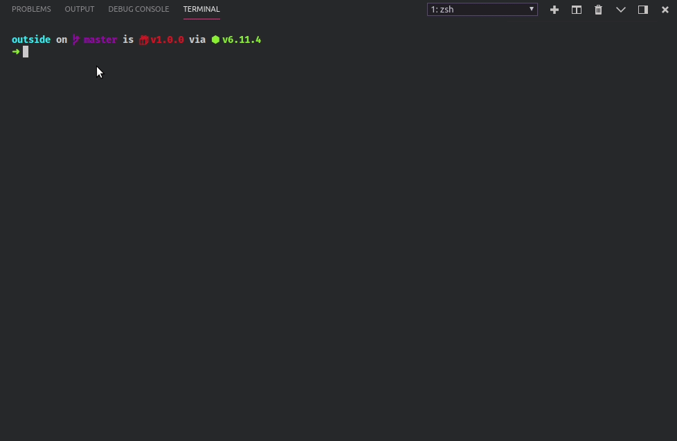

<div align="center">
  
  
  
</div>

# outside
---

<div align="center">
  
  
  
</div>


### About
---
##### Requirements
- node 8.x ( beacause ```async - await``` functions ).
##### Steps
1. Clone the project with ```git clone https://github.com/enzoftware/outside.git``` 
2. Enter the project and ``` npm install``` to install all the project dependencies
3. ``` npm link ``` to link the ```outside``` command to your path 
4. Finally, type ``` outside today forecast --location "YOUR_PLACE"```
5. And enjoy :rainbow:
